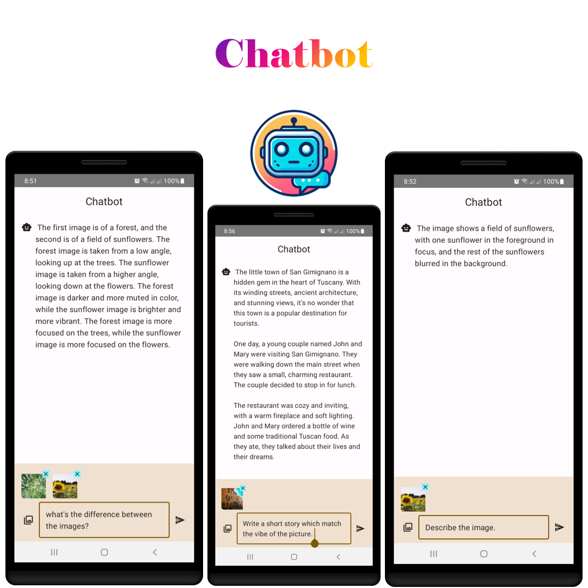

# Chatbot

**An Android app that harnesses the power of Google AI for engaging and informative responses.**

## Features

- **Interactive Chatbot:** Powered by Google Gemini Pro, the chatbot engages in natural and informative conversations, answering your questions and following your requests thoughtfully.
- **Image-Based Insights:** Uses Google Pro Vision to analyze images and provide contextual responses, enhancing the depth and relevance of interactions.
- **Sleek and Modern UI:** Built with Jetpack Compose, the app offers a beautiful and intuitive user interface, ensuring a seamless user experience.

## Tech Stack

- **Kotlin:** Primary language for development, offering conciseness, safety, and interoperability with Java.
- **Jetpack Compose:** UI toolkit for building native Android UIs with a declarative approach, simplifying UI development and code maintainability.
- **Google AI:**
    - **Google Gemini Pro:** Powerful language model for natural language understanding and generation, enabling the chatbot's capabilities.
    - **Google Pro Vision:** Image analysis API for visual understanding, adding a visual dimension to the chatbot's interactions.
- **Hilt:** Dependency injection framework for managing dependencies and facilitating testing.
- **Coil:** Image loading library for efficient image loading and display.

## Usage

1. Launch the app.
2. Type your question or request in the chat box.
3. Tap "Send" to initiate the conversation.
4. Engage in natural conversation with the chatbot.
5. Optionally, provide images for visual insights.

## Requirements

- **Minimum SDK:** 28 ("Pie"; Android 9.0).
- **Target SDK:** 34.